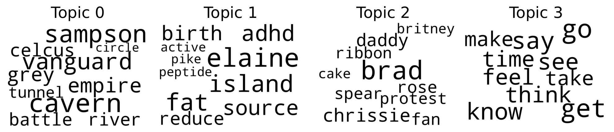
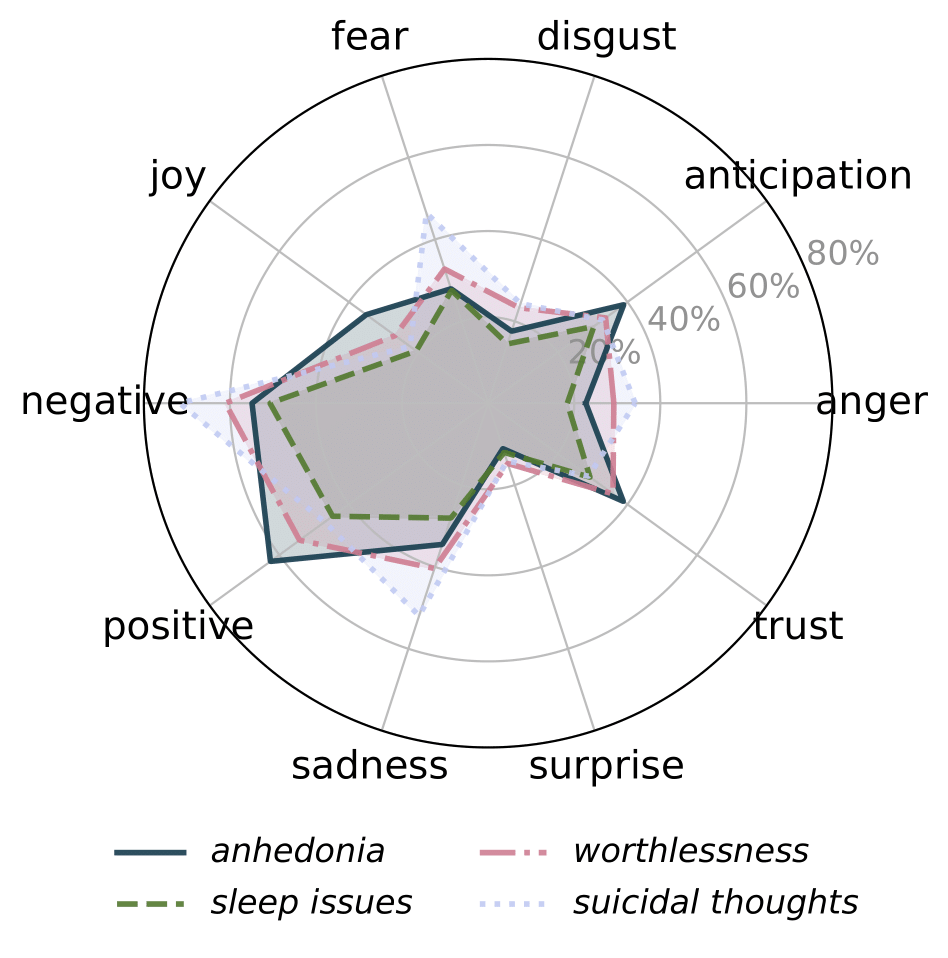

# ⚕️💬 ReDSM5: A Reddit Dataset for DSM-5 Depression Detection

<div align="center">
  <a href="mailto:eliseo.bao@udc.es">Eliseo Bao</a>, <a href="mailto:anxo.pvila@udc.es">Anxo Pérez</a> and <a href="mailto:javier.parapar@udc.es">Javier Parapar</a>
  <p>IRLab, CITIC, Universidade da Coruña, A Coruña, Spain</p>
</div>

## Abstract
Depression is a pervasive mental health condition that affects hundreds of millions of individuals worldwide, yet many cases remain undiagnosed due to barriers in traditional clinical access and pervasive stigma. Social media platforms, and Reddit in particular, offer rich, user-generated narratives that can reveal early signs of depressive symptomatology. However, existing computational approaches often label entire posts simply as *depressed* or *not depressed*, without linking language to specific criteria from the DSM-5, the standard clinical framework for diagnosing depression. This limits both clinical relevance and interpretability. To address this gap, we introduce *ReDSM5*, a novel Reddit corpus comprising 1484 long-form posts, each exhaustively annotated at the sentence level by a licensed psychologist for the nine DSM-5 depression symptoms. For each label, the annotator also provides a concise clinical rationale grounded in DSM-5 methodology. We conduct an exploratory analysis of the collection, examining lexical, syntactic, and emotional patterns that characterize symptom expression in social media narratives. Compared to prior resources, *ReDSM5* uniquely combines symptom-specific supervision with expert explanations, facilitating the development of models that not only detect depression but also generate human-interpretable reasoning. We establish baseline benchmarks for both multi-label symptom classification and explanation generation, providing reference results for future research on detection and interpretability.


## 📁 Repository Structure

```text
redsm5/
├── analysis/                            # Notebooks and scripts for exploratory data analysis and linguistic profiling
│   ├── ner.ipynb                        # Named Entity Recognition (NER) analysis across DSM-5 symptoms
│   ├── plutchik.ipynb                   # Emotion profiling using the NRC Plutchik-based emotion lexicon
│   ├── pronouns.ipynb                   # Analysis of personal pronoun usage by symptom class
│   ├── statistics.py                    # Script for computing dataset-wide statistics (post length, symptom freq., etc.)
│   ├── topic_modeling.ipynb             # Topic modeling using LDA for symptomatic vs. non-symptomatic posts
│   ├── verbs.ipynb                      # Verb tense analysis across symptom types
│   └── visuals/                         # Visual output generated by the notebooks
│       ├── ner.pdf                      # Full-page plot of NER distribution across symptoms
│       ├── plutchik.pdf                 # Emotion distribution charts (PDF)
│       ├── png/                         # PNG versions of key plots
│       │   ├── ner.png
│       │   ├── plutchik.png
│       │   ├── wordcloud_NO_symptoms.png
│       │   └── wordcloud_symptoms.png
│       ├── wordcloud_NO_symptoms.pdf    # Word clouds for posts without DSM-5 symptoms
│       └── wordcloud_symptoms.pdf       # Word clouds for posts with DSM-5 symptoms
│
├── data/                                           # Sample data extracted from the full ReDSM5 dataset
│   ├── redsm5_annotations_sample_paraphrased.csv   # Sentence-level symptom annotations + expert rationales (sample)
│   ├── redsm5_posts_sample_paraphrased.csv         # Original posts (sample), with paraphrased content for privacy
│   └── redsm5_sample.csv                           # Combined view with post-level aggregation (sample only)
│
├── Dockerfile                           # Container specification for reproducible environments
│
├── examples/                            # Notebooks showing how to train/evaluate baseline models
│   ├── bert.ipynb                       # Multi-label DSM-5 classification using BERT
│   ├── cnn.ipynb                        # CNN-based baseline for symptom detection
│   ├── llama_explanations.ipynb         # Generating clinical rationales using LLaMA for explainability
│   ├── llama.ipynb                      # LLaMA-based DSM-5 classifier baseline
│   └── svm.ipynb                        # Linear SVM baseline using TF-IDF features
│
├── README.md                            # You are here 🙂 Project overview and usage instructions
└── requirements.txt                     # Python dependencies for running all experiments and notebooks

```

## 📥 How to Obtain the Dataset

The **ReDSM5** dataset is available on the Hugging Face Hub. Follow these steps to access it:

### 1. Visit the dataset page

Navigate to [irlab‑udc/redsm5](https://huggingface.co/datasets/irlab-udc/redsm5). You'll find a full data card, usage details, and sample files including a **25‑entry anonymized preview** that you can download.

### 2. Accept the access conditions

The full dataset is gated. To gain access, you must:

* Click **“Access Dataset”**
* Agree to the dataset terms
* Fill out the **[ReDSM5 Agreement Form](https://www.irlab.org/ReDSM5_agreement.odt)**
* Send it via email to **[eliseo.bao@udc.es](mailto:eliseo.bao@udc.es)**
  Once approved, you'll receive access instructions via email.

### 📋 What you’ll get

After access, the download includes (see full dataset card for details)

* **redsm5\_posts.csv**: complete text of 1,484 posts
* **redsm5\_annotations.csv**: sentence-level annotations including DSM-5 symptoms, clinician rationales, statuses, and sentence IDs


## 🔧 Environment Setup

You can run the project either using a Docker container or your local Python environment.

### 🚀 Option 1: Using Docker (recommended for GPU users)

To build and run the Docker container with GPU support and Jupyter access:

#### 1. Build the image

```bash
docker build -t redsm5 .
```

#### 2. Launch the container

```bash
docker run --gpus all -p 8888:8888 -v $(pwd):/workspace -w /workspace redsm5 /bin/bash -c "jupyter notebook --ip=0.0.0.0 --port=8888 --no-browser --allow-root --NotebookApp.token=''"
```

* This mounts the current directory into the container at `/workspace`
* Jupyter will be accessible at [http://localhost:8888](http://localhost:8888)
* No token is required to access the interface

> Make sure [NVIDIA Container Toolkit](https://docs.nvidia.com/datacenter/cloud-native/container-toolkit/install-guide.html) is installed for `--gpus all` to work.

### 🐍 Option 2: Local Python environment

If you prefer not to use Docker, you can install the required packages directly.

#### 1. Create and activate a virtual environment (optional but recommended)

```bash
python -m venv venv
source venv/bin/activate
```

#### 2. Install dependencies

```bash
pip install -r requirements.txt
```

> Some experiments (e.g., those using LLaMA or Hugging Face Hub models) may require additional setup such as API keys or model weights.

## 📊 Dataset Overview

The **ReDSM5** corpus is a carefully curated collection of Reddit posts annotated for the nine clinical symptoms of depression defined by the DSM-5. Each post is analyzed at the sentence level by a licensed psychologist, and every label includes a concise clinical rationale. This section summarizes the dataset's main statistics and symptom distribution.

### 🧮 Main Statistics

| Statistic             | Value  | Description                                                                      |
| --------------------- | ------ | -------------------------------------------------------------------------------- |
| Number of posts       | 1,484  | Unique Reddit posts reconstructed from the DepreSym corpus                       |
| Number of negatives   | 392    | Posts that were flagged during BDI-II annotation but did not meet DSM-5 criteria |
| Average symptoms/post | 1.04   | Most posts describe only one or no symptoms                                      |
| Average words/post    | 294.71 | Posts range from brief complaints to detailed narratives                         |
| Minimum words/post    | 2      | Very short posts included for completeness                                       |
| Maximum words/post    | 6,990  | Long-form self-disclosures are common on Reddit                                  |

> The presence of 392 "negative" cases provides valuable contrastive examples for learning fine-grained clinical distinctions in language.

### 📌 Symptom Frequency

| Symptom                | Occurrences | Notes                                                  |
| ---------------------- | ----------- | ------------------------------------------------------ |
| Depressed mood         | 328         | Most frequently annotated symptom                      |
| Worthlessness          | 311         | Often expressed through self-blame or low self-worth   |
| Suicidal thoughts      | 165         | High-risk content with strong clinical relevance       |
| Fatigue                | 124         | Includes both physical and mental exhaustion           |
| Anhedonia              | 124         | Loss of interest or pleasure in usual activities       |
| Sleep issues           | 102         | Mentions of insomnia, oversleeping, or disturbed sleep |
| Cognitive issues       | 59          | Concentration problems or decision-making difficulties |
| Appetite change        | 44          | Includes increased or decreased appetite               |
| Psychomotor alteration | 35          | Least common, often subtle in textual form             |

> The distribution is imbalanced across symptoms. This reflects clinical reality and presents additional challenges for multi-label classification, particularly for low-frequency classes such as appetite change and psychomotor alteration.

### 🏷️ Named Entity Distribution

We applied Named Entity Recognition (NER) to identify structured elements such as dates, time spans, quantities, and people across DSM-5 symptom categories.


Temporal entities (DATE and TIME) were especially prevalent in *depressed mood*, *sleep issues*, and *suicidal thoughts*, reflecting the importance of time references in depressive narratives.

### 🧠 Topic Modeling

We used Latent Dirichlet Allocation (LDA) to uncover thematic contrasts between posts with and without DSM-5 symptoms.




Posts without symptoms focused on hobbies and niche interests (e.g., "vanguard", "sampson"), whereas symptomatic posts emphasized introspection and affective language with words like "feel", "life", and "psychosis".

### 🎭 Emotion and Sentiment Profile

We analyzed emotional tone using the NRC Emotion Lexicon (based on Plutchik’s model), computing the proportion of emotion-related words per symptom class.

<div align="center">
  
</div>

* *Suicidal thoughts* posts showed the highest levels of **sadness** and **fear**
* *Anhedonia* was marked by low **joy** and **trust**
* *Sleep issues* displayed a neutral emotional pattern

These findings indicate that individual symptoms carry distinct emotional signals in social media narratives.

### ✍️ Grammar and Pronoun Use

We examined grammatical patterns by analyzing verb tense and pronoun usage across symptom categories.

#### Verb Tense Distribution (%)

| Symptom                | Past  | Present | Future |
| ---------------------- | ----- | ------- | ------ |
| No symptoms            | 49.99 | 38.96   | 11.04  |
| Depressed mood         | 42.74 | 46.40   | 10.86  |
| Anhedonia              | 26.51 | 61.83   | 11.67  |
| Appetite change        | 40.33 | 50.23   | 9.44   |
| Sleep issues           | 46.19 | 43.03   | 10.78  |
| Psychomotor alteration | 40.55 | 47.81   | 11.64  |
| Fatigue                | 39.37 | 48.04   | 12.59  |
| Worthlessness          | 36.32 | 52.13   | 11.55  |
| Cognitive issues       | 31.31 | 55.98   | 12.71  |
| Suicidal thoughts      | 30.55 | 57.44   | 12.01  |

#### Pronoun Usage (%)

| Symptom                | FPS   | FPP  | SP   | TPS   | TPP  |
| ---------------------- | ----- | ---- | ---- | ----- | ---- |
| No symptoms            | 51.84 | 5.21 | 8.41 | 30.37 | 4.16 |
| Depressed mood         | 63.52 | 3.84 | 6.11 | 22.43 | 4.09 |
| Anhedonia              | 69.86 | 1.69 | 6.57 | 19.18 | 2.69 |
| Appetite change        | 68.98 | 1.17 | 5.38 | 19.95 | 4.52 |
| Sleep issues           | 65.23 | 2.53 | 7.29 | 21.11 | 3.84 |
| Psychomotor alteration | 64.60 | 2.48 | 7.13 | 22.23 | 3.56 |
| Fatigue                | 63.01 | 4.36 | 7.79 | 21.25 | 3.58 |
| Worthlessness          | 67.50 | 2.61 | 6.09 | 20.94 | 2.85 |
| Cognitive issues       | 68.30 | 1.66 | 3.32 | 24.23 | 2.49 |
| Suicidal thoughts      | 66.84 | 1.21 | 6.21 | 22.69 | 3.05 |

Symptomatic posts consistently used more first-person singular (FPS) pronouns and present-tense verbs, indicating a personal and immediate tone. In contrast, non-symptomatic posts relied more on past tense and third-person singular (TPS), reflecting retrospective or external narratives.

## 📝 Citation

This paper has been accepted as a Resource Paper at **CIKM 2025**. The official conference proceedings will be available soon. In the meantime, you can read the preprint on [arXiv](https://www.arxiv.org/abs/2508.03399):

```bibtex
@misc{bao2025redsm5,
  title        = {ReDSM5: A Reddit Dataset for DSM-5 Depression Detection},
  author       = {Eliseo Bao and Anxo Pérez and Javier Parapar},
  year         = {2025},
  eprint       = {2508.03399},
  archivePrefix= {arXiv},
  primaryClass = {cs.CL},
  url          = {https://arxiv.org/abs/2508.03399},
  note         = {Accepted at CIKM 2025}
}
```

## 📬 Contact

For questions, please reach out via email: `eliseo.bao@udc.es`
