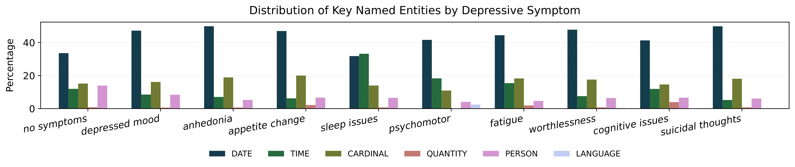
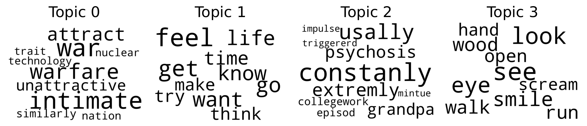

# ⚕️💬 ReDSM5: A Reddit Dataset for DSM-5 Depression Detection

<div align="center">
  <a href="mailto:eliseo.bao@udc.es">Eliseo Bao</a>, <a href="mailto:anxo.pvila@udc.es">Anxo Pérez</a> and <a href="mailto:javier.parapar@udc.es">Javier Parapar</a>
  <p>IRLab, CITIC, Universidade da Coruña, A Coruña, Spain</p>
</div>

## Abstract
Depression is a pervasive mental health condition that affects hundreds of millions of individuals worldwide, yet many cases remain undiagnosed due to barriers in traditional clinical access and pervasive stigma. Social media platforms, and Reddit in particular, offer rich, user-generated narratives that can reveal early signs of depressive symptomatology. However, existing computational approaches often label entire posts simply as *depressed* or *not depressed*, without linking language to specific criteria from the DSM-5, the standard clinical framework for diagnosing depression. This limits both clinical relevance and interpretability. To address this gap, we introduce *ReDSM5*, a novel Reddit corpus comprising 1484 long-form posts, each exhaustively annotated at the sentence level by a licensed psychologist for the nine DSM-5 depression symptoms. For each label, the annotator also provides a concise clinical rationale grounded in DSM-5 methodology. We conduct an exploratory analysis of the collection, examining lexical, syntactic, and emotional patterns that characterize symptom expression in social media narratives. Compared to prior resources, *ReDSM5* uniquely combines symptom-specific supervision with expert explanations, facilitating the development of models that not only detect depression but also generate human-interpretable reasoning. We establish baseline benchmarks for both multi-label symptom classification and explanation generation, providing reference results for future research on detection and interpretability.


## 📁 Repository Structure

```text
redsm5
├── analysis
│   ├── lexical
│   │   ├── ner.ipynb
│   │   └── topic_modeling.ipynb
│   └── linguistic
│       ├── plutchik.ipynb
│       ├── pronouns.ipynb
│       └── verbs.ipynb
├── data
│   └── redsm5_sample.csv
├── examples
│   ├── bert.ipynb
│   ├── cnn.ipynb
│   ├── llama.ipynb
│   └── svm.ipynb
├── README.md
├── requirements.txt
└── slurm
    ├── image.def
    ├── README.md
    └── run_jupyter.sh
```

## 📊 Dataset Overview

We present a detailed overview of the *ReDSM5* corpus, highlighting key statistics and linguistic patterns.

### 🧮 Main Statistics

| Statistic             | Value  |
| --------------------- | ------ |
| Number of posts       | 1,484  |
| Number of negatives   | 392    |
| Average symptoms/post | 1.04   |
| Average words/post    | 294.71 |
| Minimum words/post    | 2      |
| Maximum words/post    | 6,990  |


### 📌 Symptom Frequency

| Symptom                | Occurrences |
| ---------------------- | ----------- |
| Depressed mood         | 328         |
| Worthlessness          | 311         |
| Suicidal thoughts      | 165         |
| Fatigue                | 124         |
| Anhedonia              | 124         |
| Sleep issues           | 102         |
| Cognitive issues       | 59          |
| Appetite change        | 44          |
| Psychomotor alteration | 35          |

---

### 🏷️ Named Entity Distribution

We applied Named Entity Recognition (NER) to highlight structured mentions (e.g., time spans, quantities, people) across symptom classes. The figure below shows the percentage distribution of selected entity types by symptom:



Notably, DATE and TIME entities were common in *depressed mood*, *sleep issues*, and *suicidal thoughts*, underscoring their temporal framing in user narratives.

---

### 🧠 Topic Modeling

Latent Dirichlet Allocation (LDA) was applied separately to posts with and without symptoms. Word clouds below illustrate the top lexical tokens per topic:




Posts without symptoms often revolve around fandoms or hobbies (e.g., “vanguard,” “sampson”), whereas symptom-tagged posts foreground self-referential and affective terms like “feel,” “life,” “psychosis.”

---

### 🎭 Emotion and Sentiment Profile

Using the NRC Emotion Lexicon (based on Plutchik’s wheel), we quantified emotional tone per symptom class. The chart below shows average emotion term proportions:


* *Suicidal thoughts* posts show high levels of **sadness** and **fear**.
* *Anhedonia* exhibits diminished **joy** and **trust**.
* *Sleep issues* show a muted emotional profile.

This confirms that individual DSM-5 symptoms carry distinct emotional signatures in social-media expression.

---

### ✍️ Grammar and Pronoun Use

We analyzed grammatical structures, focusing on pronoun choice and verb tense. Results are below:

#### Verb Tense (%)

| Symptom                | Past  | Present | Future |
| ---------------------- | ----- | ------- | ------ |
| No symptoms            | 49.99 | 38.96   | 11.04  |
| Depressed mood         | 42.74 | 46.40   | 10.86  |
| Anhedonia              | 26.51 | 61.83   | 11.67  |
| Appetite change        | 40.33 | 50.23   | 9.44   |
| Sleep issues           | 46.19 | 43.03   | 10.78  |
| Psychomotor alteration | 40.55 | 47.81   | 11.64  |
| Fatigue                | 39.37 | 48.04   | 12.59  |
| Worthlessness          | 36.32 | 52.13   | 11.55  |
| Cognitive issues       | 31.31 | 55.98   | 12.71  |
| Suicidal thoughts      | 30.55 | 57.44   | 12.01  |


#### Personal Pronoun (%)

| Symptom                | FPS   | FPP  | SP   | TPS   | TPP  |
| ---------------------- | ----- | ---- | ---- | ----- | ---- |
| No symptoms            | 51.84 | 5.21 | 8.41 | 30.37 | 4.16 |
| Depressed mood         | 63.52 | 3.84 | 6.11 | 22.43 | 4.09 |
| Anhedonia              | 69.86 | 1.69 | 6.57 | 19.18 | 2.69 |
| Appetite change        | 68.98 | 1.17 | 5.38 | 19.95 | 4.52 |
| Sleep issues           | 65.23 | 2.53 | 7.29 | 21.11 | 3.84 |
| Psychomotor alteration | 64.60 | 2.48 | 7.13 | 22.23 | 3.56 |
| Fatigue                | 63.01 | 4.36 | 7.79 | 21.25 | 3.58 |
| Worthlessness          | 67.50 | 2.61 | 6.09 | 20.94 | 2.85 |
| Cognitive issues       | 68.30 | 1.66 | 3.32 | 24.23 | 2.49 |
| Suicidal thoughts      | 66.84 | 1.21 | 6.21 | 22.69 | 3.05 |


Symptomatic posts use significantly more first-person singular pronouns and present-tense verbs, highlighting their introspective and immediate tone. In contrast, non-symptom posts lean toward third-person references and past-tense narration.


## 📝 Citation

*Coming soon - paper under submission.*  
If you use this resource, please ⭐ star the repo and stay tuned for citation info.

## 📬 Contact

For questions, please reach out via email: `eliseo.bao@udc.es`